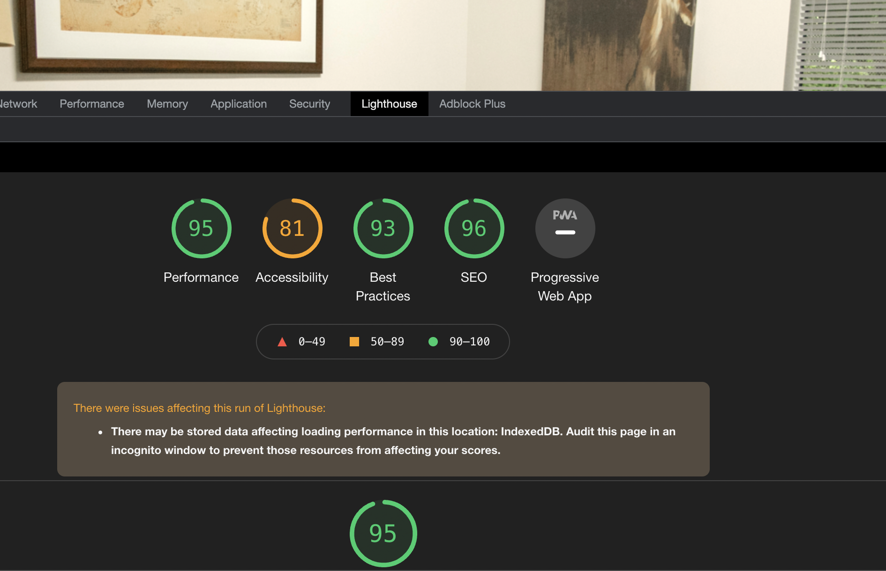
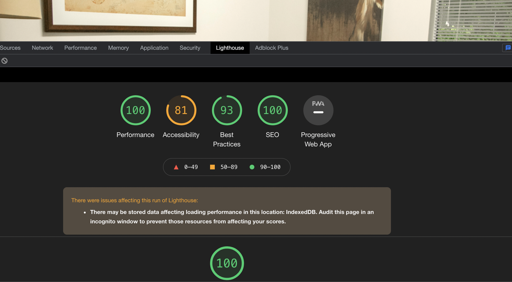

#  nativeSleepless

## Description

This project represents the Sleepless tester homepage. All features and code were written by Adam Kuemmel and no bootstrap was used. Some key features include:

```
  WHEN the user scrolls
  THEN the navbar move to top of screen and logos disapear for a better UX
  WHEN the user scrolls
  THEN the background image moves slower then the rest of the components
  WHEN the user is on mobile or tablet
  THEN the layout is completely responsive
  WHEN the user swipes the group of team cards
  THEN the cards move with the swipe
  WHEN the user scrolls over any button or anchor tag
  THEN a hover psuedo class is invoked

```

## Table of Contents

-[Installation](#installation)

-[Usage](#usage)

-[Contribution](#contribution)

-[Test](#test)

-[Technologies](#technologies)

-[Test](#test)

-[Questions](#Questions)

## Installation

```
npm i
```

## Test

```
npm run start
```

## Usage

Go to your local host and tune in to channel 3001

## License

this project is not curently using any licensing

## SEO

This project uses standard SEO practices

Mobile:


Desktop:


## Technologies

In this project you will find the following technologies and languages:

- Javascript
- HTML
- CSS
- JQUERY
- ExpressJS

## Questions

Have more questions? please reach out via message at one of these provdided links

github.com/adamkuemmel

adamkuemmel@gmail.com
